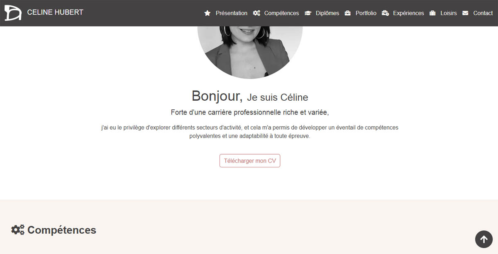

#  Celinahub-r-h-formulaire


Bienvenue sur Celinahub-r-h-formulaire, créé avec l'aide de ChatGPT 3.5 et le partage d'expertise d'un developpeur. Ce projet constitue mon premier site web, où je présente ma carrière professionnelle, mes compétences, mes diplômes, mon portfolio créatif, mon expérience professionnelle, mes loisirs, et comment les visiteurs peuvent me contacter.

## Sommaire

1. [Présentation de ma Carrière Professionnelle](#présentation-de-ma-carrière-professionnelle)
2. [Compétences](#compétences)
3. [Diplômes](#diplômes)
4. [Portfolio Créatif](#portfolio-créatif)
5. [Expérience Professionnelle](#expérience-professionnelle)
6. [Loisirs](#loisirs)
7. [Contact](#contact)
8. [Structure du Projet](#structure-du-projet)
9. [Contenu du Projet](#contenu-du-projet)
10. [Langages de Programmation, Framework et bibliothèque Javascript](#langages-de-programmation-et-framework)
11. [Remerciements](#remerciements)

## Présentation
- [**cv-celine-hubert.pdf:**](presentation/cv-celine-hubert.pdf) Téléchargez mon CV au format PDF.
- [**photo-professionnelle-celine-hubert.jpg:**](presentation/photo-professionnelle-celine-hubert.jpg) Photo professionnelle.

### Barres de Progression pour les Compétences humaines, créatives et techniques

Pour consulter l'intégralité de mes compétences et en savoir plus sur mon parcours académique, veuillez visiter la section correspondante sur [mon site celinefashiongeek](https://celinefashiongeek.netlify.app/).

## Diplômes

1. **CAP AEPE**
   - Candidat libre, Juin 2020

2. **BAC+3 stylisme / modélisme option textile**
   - LISAA Paris, 2007

3. **BAC PRO Artisanat et métiers d'Art**
   - Lycée immaculée conception Laval, 2004

4. **CAP Prêt-à-porter**
   - Lycée immaculée conception Laval, 2003

5. **BEP Métiers de la mode et des industries connexes**
   - Lycée immaculée conception Laval, 2002

## Portfolio Créatif

### Carré Soie Céline Hubert motif identité visuelle du logo ch
- Motif Graphique de mon logo ch en Noir et Blanc
- Motif Graphique de mon logo ch en couleur
- Motif Place de mon logo ch dupliqué Floral Noir et Blanc
- Motif Place de mon logo ch dupliqué Floral en couleur

### Conception Logo Céline Hubert
- Étapes 1 à 15 du processus de conception.

### Découvrir CH
- Allover Monogramme
- Monogramme
- Sac avec Logo
- Sneakers (Photos variées)

### Dossier Technique
- Descriptif du projet
- Mesures et dimensions
- Photos détaillées des poches brodées

### Texte Démarche Créative Logo CH
- À propos du projet
- Dossier technique
- Monogramme détaillé

## Expérience Professionnelle

1. **Assistante maternelle agréée**
   - Indépendante, 2017 à aujourd'hui

2. **Assistante styliste-infographiste**
   - CDI, Juin 2012-Oct 2016

3. **Infographiste-SUN CITY GROUP**
   - CDD, Avr2011-Avr2012

## Loisirs

1. **Développement web**
   
2. **Illustration**
   
3. **Shopping**
   
4. **Décoration intérieure**

5. **Bricolage**

6. **Couture**

# Mon Projet

Celinahub-r-h-formulaire est une application web complète reposant sur une architecture client-serveur. Elle tire parti de React pour le développement du frontend et de Node.js pour la gestion du backend. L'application intègre un formulaire de contact sécurisé, permettant aux utilisateurs d'envoyer des messages. Ces messages sont ensuite traités et notifiés via un service d'e-mail.

## Installation

Pour exécuter ce projet localement, suivez ces étapes :

1. Dans le répertoire du projet, exécutez la commande suivante pour démarrer le serveur de développement React :
Ouvrez http://localhost:3000 pour l’afficher dans votre navigateur.

Vous devez télecharger Node.js et npm installés sur votre machine pour exécuter le projet.

## Structure du Projet

```bash
Celinahub-r-h-formulaire/
|-- public/
|   |-- index.html
|   |-- style.css
|   |-- images/
|       |-- loisirs/
|           |-- bricolage.jpg
|           |-- couture.jpg
|           |-- decoration-interieure.jpg
|           |-- dessin-encre-de-chine.jpg
|           |-- developpement-web.jpg
|           |-- shopping.jpg
|       |-- portfolio/
|           |-- carre-soie-celine-hubert/
|               |-- motif-graphique-floral-couleur.jpg
|               |-- motif-graphique-floral-noir-blanc.jpg
|               |-- motif-place-floral-couleur.jpg
|               |-- motif-place-floral-noir-blanc.jpg
|           |-- conception-logo-celine-hubert/
|               |-- etape-1-logo-celine-hubert-ch.jpg
|               |-- etape-2-logo-celine-hubert-ch.jpg
|               |-- etape-3-logo-celine-hubert-ch.jpg
|               |-- etape-4-logo-celine-hubert-ch.jpg
|               |-- etape-5-logo-celine-hubert-ch.jpg
|               |-- etape-6-logo-celine-hubert-ch.jpg
|               |-- etape-7-logo-celine-hubert-ch.jpg
|               |-- etape-8-logo-celine-hubert-ch.jpg
|               |-- etape-9-logo-celine-hubert-ch.jpg
|               |-- etape-10-logo-celine-hubert-ch.jpg
|               |-- etape-11-logo-celine-hubert-ch.jpg
|               |-- etape-12-logo-celine-hubert-ch.jpg
|               |-- etape-13-logo-celine-hubert-ch.jpg
|               |-- etape-14-logo-celine-hubert-ch.jpg
|               |-- etape-15-logo-celine-hubert-ch.jpg
|           |-- decouvrir-ch/
|               |-- allover-monogramme.jpg
|               |-- monogramme.png
|               |-- sac-logo.jpg
|               |-- sneakers.jpg
|               |-- sneakers2.jpg
|           |-- dossier-technique/
|               |-- descriptif.jpg
|               |-- mesures.jpg
|               |-- poches-broderie.jpg
|               |-- zoom-poche-devant.jpg
|               |-- zoom-poche-dos.jpg
|           |-- texte-demarche-creative-logo-ch/
|               |-- a-propos.jpg
|               |-- dossier-technique.jpg
|               |-- monogramme-ch.jpg
|   |-- presentation/
|       |-- cv-celine-hubert.pdf
|       |-- photo-professionnelle-celine-hubert.jpg
|   |-- mon-logo.png
|-- src/
|   |-- .env
|   |-- App.css
|   |-- App.js
|   |-- DarkModeToggle.js
|   |-- Form.js
|   |-- index.css
|   |-- index.js
|   |-- reportWebVitals.js
|   |-- server.js
|   |-- style.css
|-- node_modules
|-- .env
|-- package.json
|-- .gitignore
|-- README.md
|-- robots.txt
```

2. Dans le dossier src, exécutez la commande suivante pour démarrer le serveur backend Node.js :

node server.js
Serveur écoutant sur le port 5000

## Contenu du Projet

Le projet est structuré comme suit :

- **index.html:** Fichier principal du site web.
- **style.css:** Feuille de style pour la mise en page.
- **images/:** Répertoire contenant des images utilisées dans le site.
  - **loisirs/:** Images liées à mes loisirs.
  - **portfolio/:** Images de mes projets artistiques.
- **presentation/:** Dossier contenant des éléments de présentation.
  - **cv-celine-hubert.pdf:** Mon curriculum vitae au format PDF.
  - **photo-professionnelle-celine-hubert.jpg:** Photo professionnelle.

- **mon-logo.png:** Image de mon logo personnel.

- **src/:**
  - **App.css/:** Feuille de style spécifique à l'application React.
  - **App.js/:** Composant principal de l'application React.
  - **DarkModeToggle.js/:** Composant gérant le basculement entre le mode sombre et le mode clair.
  - **Form.js/:** Composant React lié aux formulaires.
  - **index.css/:** Styles globaux de l'application.
  - **index.js /:** Point d'entrée principal pour le rendu de l'application React.
  - **reportWebVitals.js /:** Script pour la collecte de statistiques web (Web Vitals).
  - **server.js /:** Fichier pour la configuration du serveur (peut être utilisé pour le développement local).
- **node_modules/:** Répertoire contenant les dépendances Node.js installées.
- **.env/:** Fichier de configuration global pour les variables d'environnement.
- **package.json /:** Fichier de configuration de gestion des dépendances Node.js.
- **.gitignore /:** Fichier spécifiant les fichiers et répertoires à ignorer lors du suivi Git.
- **README.md /:** Fichier contenant la documentation du projet.
- **robots.txt /:** Fichier spécifiant les règles d'exploration des robots pour les moteurs de recherche.


### Langages de Programmation
- HTML5
- CSS3
- JavaScript (y compris React)
- Node.js

### bibliothèque JavaScript pour la construction d'interfaces utilisateur
- React

### Framework
- Bootstrap 5


### Remerciements
N'hésitez pas à explorer les différents répertoires pour découvrir mes projets artistiques, mon parcours professionnel, et en apprendre davantage sur moi. Je tiens à remercier koala819 pour son précieux soutien et ses conseils pendant le développement de ce projet.
Merci d'avoir visité Celinahub-r-h-formulaire! N'hésitez pas à me contacter pour toute question ou amélioration.

---
**Céline Hubert**


